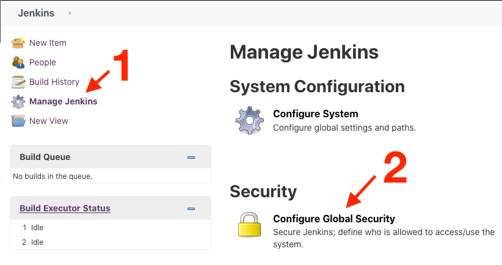

# Description

Allows an administrator to specify sites trusted to make JSONP or primitive-XPath REST API requests.

# Configuration

Use *Manage Jenkins » Configure Global Security* to make this configuration.

- Allow requests without Referer: if checked, then requests with no HTTP Referer will be allowed.
- Domains from which to allow requests: a space and/or newline-separated list of domains to allow requests from.

There is on-line help available for each option.

# Changelog

## Version 1.5 and newer

See [GitHub releases](https://github.com/jenkinsci/secure-requester-whitelist-plugin/releases).

## Version 1.4 and older

See [historical changelog](https://github.com/jenkinsci/secure-requester-whitelist-plugin/blob/e5ea6860e827a5ab7c86ea14356ce8c812714c2b/README.md#version-14-2019-09-05).
